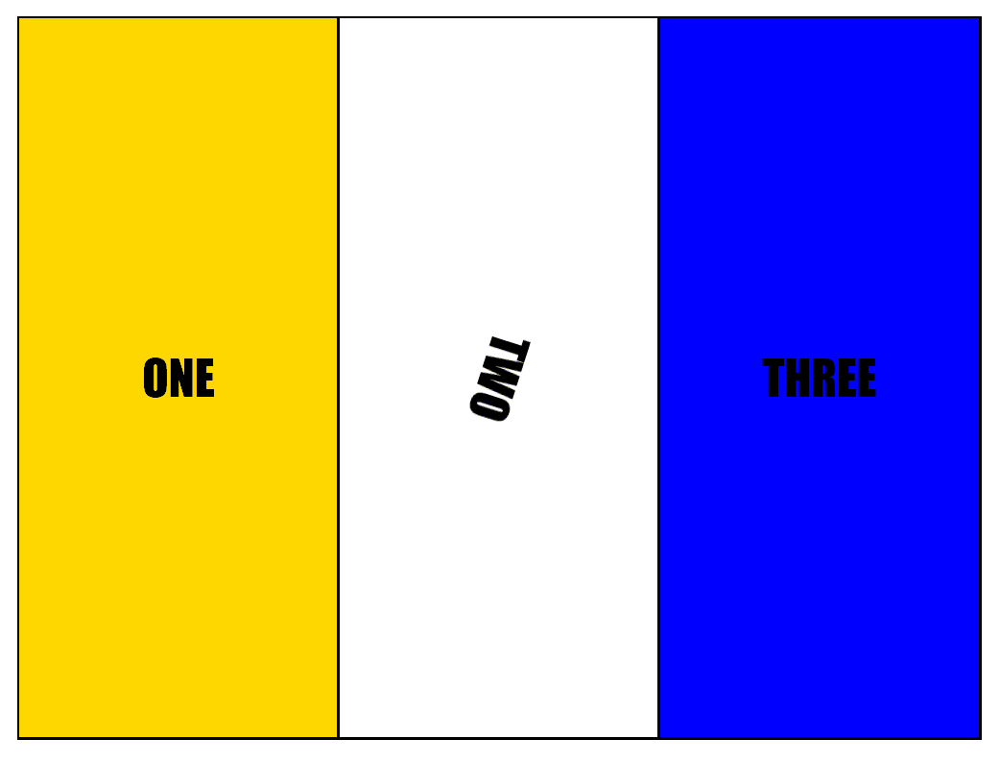

# Nadia's Technical CSS Exercise 1

## BIS Technical Exercise
I recreated the demonstrated code as closely as posible from the given animated GIF, as a technical exercise. 

The code is mostly written in CSS. 

 - The provided animated GIF 

## Questions 
For questions about this exercise please contact me:  
* Email: nadiadorado@gmail.com 
* Github: (https://github.com/ndorado3) 

